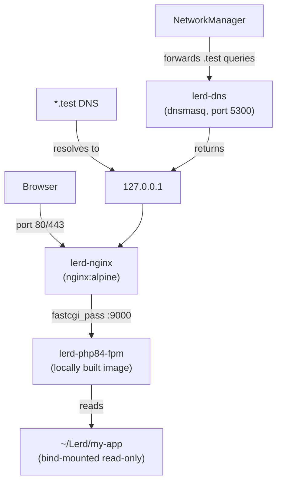

# Architecture

All containers join the rootless Podman network `lerd`. Communication between Nginx and PHP-FPM uses container names as hostnames.

## Request flow

## Components

| Component | Technology |
|---|---|
| CLI | Go + Cobra, single static binary |
| Web server | Podman Quadlet — `nginx:alpine` |
| PHP-FPM | Podman Quadlet per version — locally built image with all Laravel extensions |
| PHP CLI | `php` binary inside the FPM container (`podman exec`) |
| Composer | `composer.phar` via bundled PHP CLI |
| Node | [fnm](https://github.com/Schniz/fnm) binary, version per project |
| Services | Podman Quadlet containers |
| DNS | dnsmasq container + NetworkManager integration |
| TLS | [mkcert](https://github.com/FiloSottile/mkcert) — locally trusted CA |

## Key design decisions

**Rootless Podman** — all containers run without root privileges. The only operations requiring `sudo` are DNS setup (writes to `/etc/NetworkManager/`) and the initial `net.ipv4.ip_unprivileged_port_start=80` sysctl.

**Podman Quadlets** — containers are defined as systemd unit files (`.container` files) managed by the Quadlet generator. This means `systemctl --user start lerd-nginx` works like any other systemd service, and containers restart on failure and at login.

**Shared nginx** — a single nginx container serves all sites via virtual hosts. nginx uses a Podman-network-aware resolver to route `fastcgi_pass` to the correct PHP-FPM container by hostname.

**Per-version PHP-FPM** — each PHP version gets its own container built from a local `Containerfile`. The image includes all extensions needed for Laravel out of the box: `pdo_mysql`, `pdo_pgsql`, `bcmath`, `mbstring`, `xml`, `zip`, `gd`, `intl`, `opcache`, `pcntl`, `exif`, `sockets`, `redis`, `imagick`.
